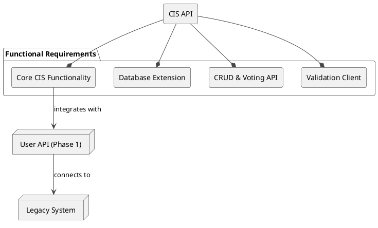
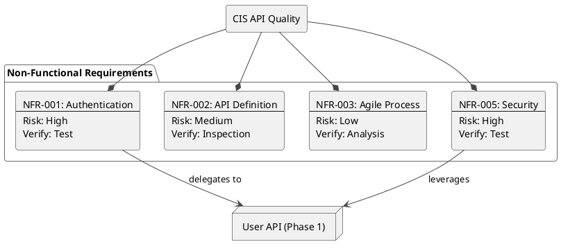

# 03-Requirements

This document details the functional and non-functional requirements for the Collaborative Ideation Solution (CIS) API, focusing on **Phase 2: CIS API Implementation**. These requirements are derived from the project guide to ensure the API's successful development and integration.

## Functional Requirements (Phase 2)

Functional requirements define the specific behaviors and functions of the system.

*   **FR-001**: The system must implement the core functionalities of the Collaborative Ideation Solution (CIS).
*   **FR-002**: The CIS must integrate with the legacy system through the User API developed in Phase 1.
*   **FR-003**: The existing database must be extended to support CIS features.
    *   **FR-003.1**: A table for `topics` must be added.
    *   **FR-003.2**: A table for user `ideas` must be added.
*   **FR-004**: A modern CIS API must be developed to manage ideation entities.
    *   **FR-004.1**: The API must handle Create, Read, Update, and Delete (CRUD) operations for topics.
    *   **FR-004.2**: The API must handle CRUD operations for ideas.
    *   **FR-004.3**: The API must allow users to vote on ideas.
    *   **FR-004.4**: The API must allow users to cancel their votes on ideas.
*   **FR-005**: A simple client API must be developed to validate the CIS API.
    *   **FR-005.1**: The client must be able to simulate "n" concurrent users.
    *   **FR-005.2**: The client must be able to validate the creation of topics, ideas, and votes.

### Functional Requirements Diagram

The following diagram illustrates the relationships between the core functional components of the CIS API.

## Non-Functional Requirements (Phase 2)

Non-functional requirements define the quality attributes and constraints of the system.

*   **NFR-001**: All interactions with the CIS API must be authenticated.
    *   **NFR-001.1**: Authentication must be performed by the User API from Phase 1.
*   **NFR-002**: The CIS API must be formally defined using the OpenAPI (Swagger) specification before implementation begins.
*   **NFR-003**: The development process must follow an agile Software Development Life Cycle (SDLC).
*   **NFR-004**: The project must be implemented with an adequate and detailed software structure.
*   **NFR-005**: The API must be secure, restricting access to authorized users.
    *   **NFR-005.1**: Security mechanisms (e.g., login/password) should build upon those provided by the User API.
*   **NFR-006**: The User API must ensure data consistency with the legacy system (a requirement from Phase 1 that impacts Phase 2).

### Non-Functional Requirements Diagram

This diagram shows the key quality constraints and their relationships.

## Future Considerations (Phase 3)

These are anticipated future requirements that should be considered during the design of the Phase 2 implementation to ensure forward compatibility.

*   **FC-001**: The system's database is planned to be migrated from MySQL to MongoDB. The CIS API must be designed to be adaptable to this change.
*   **FC-002**: Both the User API (Phase 1) and CIS API (Phase 2) will need to be adapted to be fully compatible with the new NoSQL database.
*   **FC-003**: System performance must be maintained or improved after the database migration and technology stack changes.