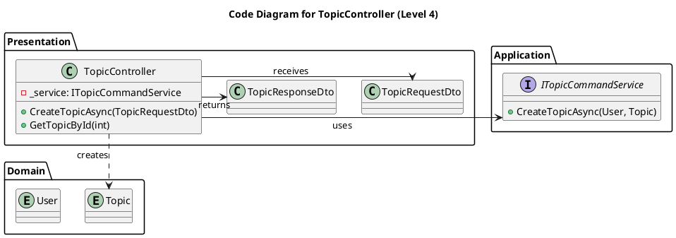

# C4 Model for the CIS API

This document provides a full 4-level C4 model for the architecture of the **CIS API** (`backend-service`). The diagrams are derived from the source code, focusing on the `CIS API` as the system boundary.

## Level 1: System Context

The System Context diagram shows the `CIS API` as a single black box, illustrating its relationships with the people and other software systems it interacts with. At this level of abstraction, the database is considered an internal implementation detail.

- **Audience**: All stakeholders, technical and non-technical.
- **Key Message**: Shows the API's boundaries and high-level interactions.

```plantuml
@startuml
!include https://raw.githubusercontent.com/plantuml-stdlib/C4-PlantUML/master/C4_Context.puml
LAYOUT_WITH_LEGEND()

title System Context for CIS API (Level 1)

Person(user, "Authenticated User", "A user of the ideation platform.")
System(cis_api, "CIS API", "Manages topics, ideas, and votes.")
System_Ext(user_api, "Users API", "Handles user authentication.")

Rel(user, cis_api, "Uses", "JSON/HTTPS")
Rel(cis_api, user_api, "Authenticates users via", "HTTPS")
@enduml
```

## Level 2: Containers

This diagram zooms into the `CIS API` system boundary, showing its major internal building blocks. Since the `CIS API` is a single deployable unit (a single container), this diagram shows the logical, high-level layers of the application, which are structured as separate projects following the Clean Architecture pattern.

- **Audience**: Developers and architects.
- **Key Message**: Shows the high-level, in-process structure of the API.

```plantuml
@startuml
!include https://raw.githubusercontent.com/plantuml-stdlib/C4-PlantUML/master/C4_Container.puml
LAYOUT_WITH_LEGEND()

title "Container" Diagram for CIS API (Level 2)

System_Boundary(cis_api_boundary, "CIS API") {
    Container(presentation, "Presentation Layer", "ASP.NET Core", "Exposes API endpoints.")
    Container(application, "Application Layer", ".NET Library", "Implements use cases.")
    Container(domain, "Domain Layer", ".NET Library", "Contains entities and domain logic.")
    Container(infrastructure, "Infrastructure Layer", ".NET Library", "Implements external concerns (e.g., DB access).")
}

System_Ext(user, "Authenticated User")
System_Ext(user_api, "Users API")
SystemDb_Ext(db, "Database", "MySQL")

Rel(user, presentation, "Uses")
Rel(presentation, user_api, "Delegates authentication to")
Rel(presentation, application, "Uses")
Rel(application, domain, "Uses")
Rel(application, infrastructure, "Uses (via DI)")
Rel(infrastructure, db, "Reads/writes to")
Rel(infrastructure, domain, "Implements interfaces from")
@enduml
```

## Level 3: Components

This diagram zooms into the **Presentation Layer** container, showing its internal components. It illustrates how incoming requests are handled and delegated to the application layer.

- **Audience**: Developers.
- **Key Message**: Shows the key components of the API's entry point.

```plantuml
@startuml
!include https://raw.githubusercontent.com/plantuml-stdlib/C4-PlantUML/master/C4_Component.puml
LAYOUT_WITH_LEGEND()

title Component Diagram for Presentation Layer (Level 3)

Container_Boundary(presentation_boundary, "Presentation Layer") {
    Component(auth_mw, "BasicAuth Middleware", "Middleware", "Intercepts requests and authenticates the user.")
    Component(topic_controller, "TopicController", "API Controller", "Handles POST /topics.")
    Component(topic_query_controller, "TopicQueryController", "API Controller", "Handles GET /topics.")
    Component(health_controller, "HealthCheckController", "API Controller", "Handles GET /healthcheck.")
}

System_Ext(user, "Authenticated User")
Container_Ext(app_layer, "Application Layer", "Container")

Rel(user, auth_mw, "Sends credentials to")
Rel(auth_mw, topic_controller, "Forwards request to")
Rel(auth_mw, topic_query_controller, "Forwards request to")
Rel(auth_mw, health_controller, "Forwards request to")

Rel(topic_controller, app_layer, "Uses ITopicCommandService from")
Rel(topic_query_controller, app_layer, "Uses ITopicQueryService from")
@enduml
```

## Level 4: Code

The Code diagram provides the most detailed view, zooming into a component to show its code-level elements. This example shows the key classes and interfaces involved in the "Create Topic" use case, illustrating the static structure and dependencies for this specific feature.

- **Audience**: Developers.
- **Key Message**: Shows the code structure for a single feature.


