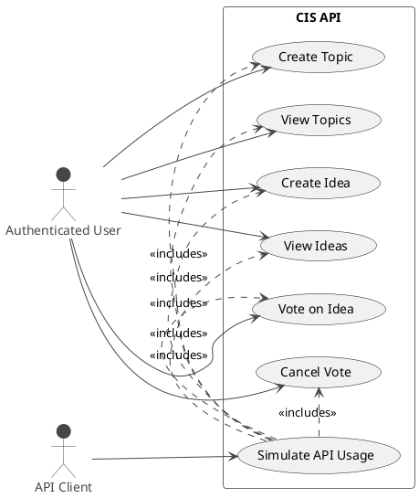

# 04-User Stories

User Stories are concise descriptions of a software functionality from the end-user's perspective. They describe what the user wants to achieve and why, focusing on the value the functionality will bring. These stories serve as a foundation for planning and development, promoting collaboration and shared understanding within the team.

This section details the user stories that contribute to the **CIS API Implementation** Epic, covering the central functionalities of the ideation platform.

## User Stories & Acceptance Criteria

### US-001: Create a New Topic

*   **As an** authenticated user,
*   **I want to** create a new topic by providing a title and description,
*   **so that** I can organize ideas by subject.

**Acceptance Criteria:**

1.  Given I am authenticated, when I send a `POST` request to `/topics` with a valid title and description, then the system creates a new topic.
2.  The response must return the newly created topic object, including its unique system-generated ID.
3.  If the title is missing from the request, the system must return a `400 Bad Request` error.

### US-002: View Existing Topics

*   **As an** authenticated user,
*   **I want to** view the list of existing topics,
*   **so that** I can choose a subject of interest.

**Acceptance Criteria:**

1.  Given I am authenticated, when I send a `GET` request to `/topics`, the system returns a list of all available topics.
2.  Each topic in the list must contain its ID, title, and description.
3.  If no topics exist, the system must return an empty list.

### US-003: Create a New Idea Within a Topic

*   **As an** authenticated user,
*   **I want to** create a new idea within a specific topic by providing a description,
*   **so that** I can contribute my suggestions.

**Acceptance Criteria:**

1.  Given I am authenticated and a topic exists, when I send a `POST` request to `/topics/{topicId}/ideas` with a valid description, the system creates a new idea linked to that topic.
2.  The response must return the newly created idea object, including its unique ID.
3.  If the specified `{topicId}` does not exist, the system must return a `404 Not Found` error.
4.  If the description is missing from the request, the system must return a `400 Bad Request` error.

### US-004: View Ideas for a Specific Topic

*   **As an** authenticated user,
*   **I want to** view the ideas of a specific topic,
*   **so that** I can see other users' suggestions.

**Acceptance Criteria:**

1.  Given I am authenticated and a topic exists, when I send a `GET` request to `/topics/{topicId}/ideas`, the system returns a list of all ideas for that topic.
2.  Each idea in the list must include its ID, description, and current vote count.
3.  If the specified `{topicId}` does not exist, the system must return a `404 Not Found` error.

### US-005: Vote on an Idea

*   **As an** authenticated user,
*   **I want to** vote on an idea,
*   **so that** I can show my support for it.

**Acceptance Criteria:**

1.  Given I am authenticated and an idea exists, when I send a `POST` request to `/ideas/{ideaId}/vote`, the system increments the vote count for that idea by one.
2.  The system must prevent a user from voting on the same idea more than once.
3.  If the specified `{ideaId}` does not exist, the system must return a `404 Not Found` error.
4.  The response must confirm that the vote was successfully registered.

### US-006: Cancel a Vote on an Idea

*   **As an** authenticated user,
*   **I want to** cancel my vote on an idea,
*   **so that** I can change my mind.

**Acceptance Criteria:**

1.  Given I am authenticated and have previously voted on an idea, when I send a `DELETE` request to `/ideas/{ideaId}/vote`, the system decrements the vote count for that idea by one.
2.  The system must prevent a user from canceling a vote if they have not previously voted for that idea.
3.  If the specified `{ideaId}` does not exist, the system must return a `404 Not Found` error.
4.  The response must confirm the vote was successfully canceled.

### US-007: API Client Simulation

*   **As an** API client user,
*   **I want to** simulate CRUD operations for topics and ideas, including voting,
*   **so that** I can test the CIS API.

**Acceptance Criteria:**

1.  The client application can simulate multiple authenticated users.
2.  The client can perform all actions defined in user stories US-001 through US-006.
3.  The client can run a complete scenario that simulates a configurable number of users interacting with the API concurrently to create topics, add ideas, and vote.

## Use Case Diagram

This diagram provides a visual overview of the user stories and the actors involved.

