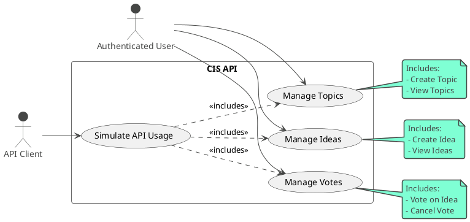
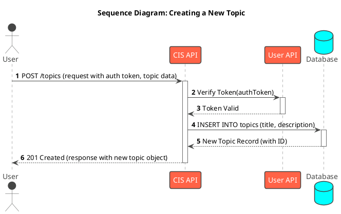
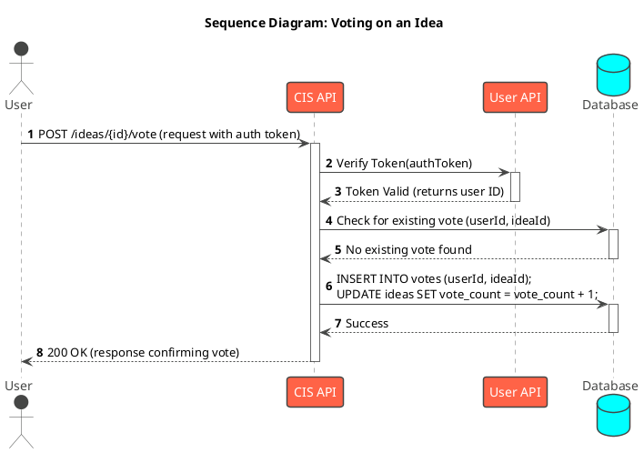
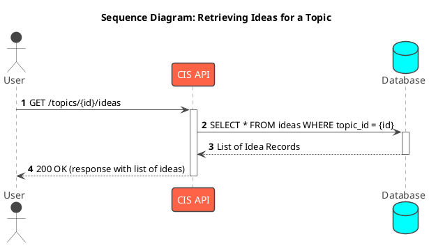

# 05-UML Diagrams

UML (Unified Modeling Language) diagrams are essential tools for visualizing, specifying, constructing, and documenting the artifacts of a software system. For the CIS API, key UML diagrams help in understanding the system's behavior, structure, and interactions.

## Use Case Diagram

A Use Case Diagram illustrates the high-level functional requirements of the system and how different external actors interact with it. This diagram provides a bird's-eye view of the services the CIS API offers.

## Sequence Diagrams

Sequence Diagrams illustrate the order of interactions between objects for a specific scenario. They are invaluable for detailing the step-by-step logic of an operation.

### Scenario: Creating a New Topic

This diagram shows the process of an authenticated user creating a new topic.

### Scenario: Voting on an Idea

This diagram details the logic for a user voting on an idea, including validation steps.

### Scenario: Retrieving Ideas for a Topic

This diagram shows the simpler flow of retrieving data from the API.

## Class Diagrams (Optional, but Recommended)

Class Diagrams provide a static view of the system, illustrating the classes, their attributes, operations, and the relationships among them. For the CIS API, a Class Diagram could represent the core data models (Topic, Idea, Vote, User) and their relationships, providing a clear understanding of the API's internal structure.

*(Placeholder for Class Diagram image)*

These diagrams serve as a visual guide for developers, helping them to understand the system's design and behavior before diving into the code.
