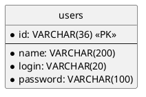

# Introduction

This is a basic JAVA companion app (*CLI*) for Software Development 3, allowing the  **CRUD** of users.

## Table of Contents

- [Introduction](#introduction)
- [Requirements](#requirements)
    - [Prerequisites](#prerequisites)
    - [Setup Steps](#setup-steps)
- [DB Schema Reference](#db-schema-reference)
    - [Entity Relationship Diagram (ERD)](#entity-relationship-diagram-erd)
- [DB Configuration File](#db-configuration-file)
- [Usage](#usage)
- [Execution Examples](#execution-examples)
- [Connection Details](#connection-details)
- [Troubleshooting](#troubleshooting)
- [Log of Changes](#log-of-changes)

# Requirements

## Prerequisites

Before you begin, ensure you have the following installed:

- **Java Development Kit (JDK) 21:** This project is built using Java 21. You can check your version with
  `java -version`.
- **Maven:** Used for building the project. You can check your version with `mvn -version`.
- **Docker and Docker Compose:** Used to run the MySQL database in a container.
    - [Install Docker](https://docs.docker.com/engine/install/)
    - [Install Docker Compose](https://docs.docker.com/compose/install/)

## Setup Steps

This app works with **MySQL**. For simplicity, we recommend using **Docker Compose**.

1. **Run the database container:**

   The `docker-compose.yml` file included in the project will start the MySQL container. The database `sd3` will be
   created automatically on startup.

   ```bash
   docker compose up -d
   ```
   > **Note:** The command `docker compose` (with a space) is for Docker Compose V2. If you are using an older version, you might need to use `docker-compose` (with a hyphen).

2. **Create the `users` table:**

   After the container is running, you need to create the `users` table inside the `sd3` database. Run the following
   command:

   ```bash
   docker compose exec db mysql -uroot -psd5 sd3 -e "CREATE TABLE users (id VARCHAR(36) NOT NULL, name VARCHAR(200) NOT NULL, login VARCHAR(20) NOT NULL, password VARCHAR(100) NOT NULL, PRIMARY KEY (id), UNIQUE INDEX id_UNIQUE (id ASC) VISIBLE);"
   ```

# DB Schema Reference

For reference, here is the schema for the `users` table:

```sql
CREATE TABLE `users`
(
    `id`       VARCHAR(36)  NOT NULL,
    `name`     VARCHAR(200) NOT NULL,
    `login`    VARCHAR(20)  NOT NULL,
    `password` VARCHAR(100) NOT NULL,
    PRIMARY KEY (`id`),
    UNIQUE INDEX `id_UNIQUE` (`id` ASC) VISIBLE
);
```

### Entity Relationship Diagram (ERD)



# DB Configuration File

You will need a configuration file to connect (example):

```xml
<?xml version="1.0" encoding="UTF-8" ?>
<!DOCTYPE configuration
        PUBLIC "-//mybatis.org//DTD Config 3.0//EN"
        "http://mybatis.org/dtd/mybatis-3-config.dtd">
<configuration>
    <environments default="development">
        <environment id="development">
            <transactionManager type="JDBC"/>
            <dataSource type="POOLED">
                <property name="driver" value="com.mysql.cj.jdbc.Driver"/>
                <property name="url" value="jdbc:mysql://localhost:3307/sd3"/>
                <property name="username" value="root"/>
                <property name="password" value="sd5"/>
            </dataSource>
        </environment>
    </environments>
</configuration>
```

# Usage

Just compile and run this program:

```
Users CLI

Usage: users -config=<configuration> [COMMAND]
CRUD on a Users DB
      -config=<configuration>
         Configuration File (xml)
Commands:
  -read    Read Users
  -delete  Delete a User by ID
  -create  Create a new user
  -update  Update an existing user
```

# Execution Examples

This section shows a complete CRUD workflow.

### 1. Create a User

First, let's create a new user "maria".

```bash
$ java -jar target/UsersCLI-1.0-SNAPSHOT-jar-with-dependencies.jar -config=sd3.xml -create -n maria -l mlopez -p pass456

Users CLI
Running User CRUD...
Loading configuration from [sd3.xml]
Creating user {Id: [ebe2ce10-9c30-4b55-8609-445802b61f34], Name: [maria], Login: [mlopez]}
Opening Session
Closing Session
```

### 2. Read Users

Now, let's read all users to see our new user alongside any existing ones.

```bash
$ java -jar target/UsersCLI-1.0-SNAPSHOT-jar-with-dependencies.jar -config=sd3.xml -read

Users CLI
Running User CRUD...
Loading configuration from [sd3.xml]
Opening Session
Closing Session
Users found: [2]
[1] Id: [8f170a57-f2d9-43d8-b0b1-4b9eac9ae77a], Name: [javier], Login: [jroca]
[2] Id: [ebe2ce10-9c30-4b55-8609-445802b61f34], Name: [maria], Login: [mlopez]
```

### 3. Update a User

Next, we'll update the user "javier" (ID: `8f170a57-f2d9-43d8-b0b1-4b9eac9ae77a`) to change their name and login.

```bash
$ java -jar target/UsersCLI-1.0-SNAPSHOT-jar-with-dependencies.jar -config=sd3.xml -update -i 8f170a57-f2d9-43d8-b0b1-4b9eac9ae77a -n "Javier Roca" -l jroca-updated -p newpass

Users CLI
Running User CRUD...
Loading configuration from [sd3.xml]
Updating user {8f170a57-f2d9-43d8-b0b1-4b9eac9ae77a}
Opening Session
Closing Session
```

### 4. Delete a User

Now, we will delete the user we just updated.

```bash
$ java -jar target/UsersCLI-1.0-SNAPSHOT-jar-with-dependencies.jar -config=sd3.xml -delete 8f170a57-f2d9-43d8-b0b1-4b9eac9ae77a

Users CLI
Running User CRUD...
Loading configuration from [sd3.xml]
Will delete an user with id = [8f170a57-f2d9-43d8-b0b1-4b9eac9ae77a]
Opening Session
Closing Session
```

### 5. Final Read

Finally, let's read the users one last time to confirm the deletion.

```bash
$ java -jar target/UsersCLI-1.0-SNAPSHOT-jar-with-dependencies.jar -config=sd3.xml -read

Users CLI
Running User CRUD...
Loading configuration from [sd3.xml]
Opening Session
Closing Session
Users found: [1]
[1] Id: [ebe2ce10-9c30-4b55-8609-445802b61f34], Name: [maria], Login: [mlopez]
```

# Connection Details

If you need to connect to the database using a different client (like DBeaver, DataGrip, etc.), use the following
credentials:

- **Host:** `localhost`
- **Port:** `3307`
- **Database/Schema:** `sd3`
- **Username:** `root`
- **Password:** `sd5`

These values are defined in the `docker-compose.yml` and `sd3.xml` files.

# Troubleshooting

Here are some common issues and their solutions:

- **Error: `docker-compose: command not found`**
    - **Cause:** You might be using Docker Compose V2, which uses a space instead of a hyphen.
    - **Solution:** Try running the command with a space: `docker compose`. If that doesn't work, you may need to install it. Follow the official [Docker Compose installation guide](https://docs.docker.com/compose/install/).

- **Error: `Cannot connect to the Docker daemon`**
    - **Cause:** The Docker service is not running.
    - **Solution:** Start the Docker daemon on your system. This is usually done via `systemctl start docker` on Linux
      or by starting the Docker Desktop application on Windows/macOS.

- **Error: Connection refused or `Can't connect to local MySQL server`**
    - **Cause:** The database container is not running.
    - **Solution:** Make sure the Docker container is up and running by executing `docker compose ps`. If it's not
      running, start it with `docker compose up -d`.

- **Error: `Table 'sd3.users' doesn't exist`**
    - **Cause:** The `users` table was not created after the container was started.
    - **Solution:** You need to run the command to create the table as specified in the **Requirements** section.

- **Error when building: `invalid target release: 21` or similar**
    - **Cause:** You are not using JDK 21 to build the project.
    - **Solution:** Make sure you have JDK 21 installed and that it is the default JDK for your environment. You can
      check with `java -version` and `mvn -version`.

- **Error: `no main manifest attribute` or `NoClassDefFoundError` when running the JAR**
    - **Cause:** The application was not packaged correctly. The executable JAR must include all its dependencies (a "
      fat JAR").
    - **Solution:** Make sure you have built the project using `mvn clean package`. This command is configured to
      generate the correct executable JAR file in the `target` directory.

- **Error: `Access denied for user 'root' @'...'`**
    - **Cause:** The credentials in your `sd3.xml` file do not match the credentials expected by the database.
    - **Solution:** Ensure the `username` and `password` properties in `sd3.xml` are set to `root` and `sd5`,
      respectively, to match the values in `docker-compose.yml`.
