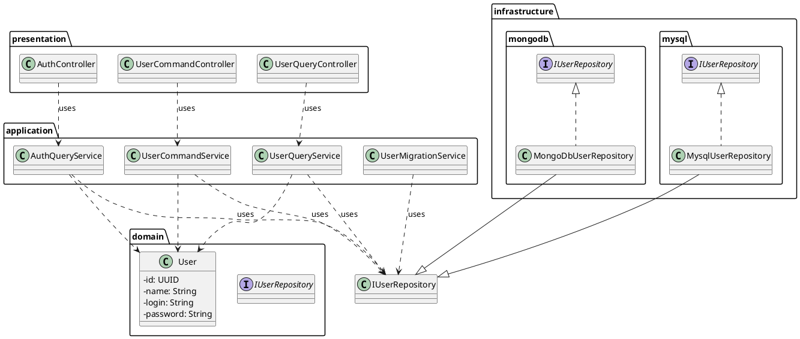

# C4 Model for Crowdsourced Ideation Solution (CIS)

## 1. System Context Diagram (C4 Level 1)

The System Context Diagram is the highest level of abstraction, showing the entire **Crowdsourced Ideation Solution (CIS)** as a single black box. It illustrates how the system interacts with its users and other external systems.

This diagram sets the stage for understanding the system's boundaries and its primary interactions.

- **Audience**: Everyone (technical and non-technical).
- **Key Message**: "Here is the system we are building, who uses it, and what other systems it interacts with."

```plantuml
 @startuml
!include https://raw.githubusercontent.com/plantuml-stdlib/C4-PlantUML/master/C4_Context.puml

LAYOUT_WITH_LEGEND()

Person(user, "User", "A user who proposes and votes on ideas.")
System(cis, "Crowdsourced Ideation Solution (CIS)", "The complete platform for ideation, including the Users API and CIS API.")

System_Ext(legacy_cli, "Legacy CLI System", "The existing command-line interface for managing users.")

Rel(user, cis, "Uses")
Rel(legacy_cli, cis, "Manages users via")

 @enduml
```

## 2. Container Diagram (C4 Level 2)

This Container Diagram zooms into the **Crowdsourced Ideation Solution (CIS)** to show its main building blocks, or "containers." Each container represents a separate deployable or runnable unit.

This diagram illustrates the high-level architecture of the system and the technology choices for each container.

- **Audience**: Developers, architects, and operations staff.
- **Key Message**: "Here are the major structural blocks of our system, the technologies they use, and how they communicate."

```plantuml
@startuml
!include https://raw.githubusercontent.com/plantuml-stdlib/C4-PlantUML/master/C4_Container.puml

LAYOUT_WITH_LEGEND()

Person(user, "User", "A user of the system.")

System_Boundary(cis_boundary, "Crowdsourced Ideation Solution (CIS)") {
    Container(client_app, "Client Application", "e.g., Web App", "Provides the user interface for interacting with the CIS.")
    Container(users_api, "Users API", "Java, Spring Boot", "Manages users, including CRUD operations and authentication, with configurable database backend (MySQL/MongoDB).")
    Container(cis_api, "CIS API", "C# (planned)", "Manages topics, ideas, and voting.")
}

SystemDb_Ext(configurable_db, "Configurable User Database", "MySQL or MongoDB", "Stores user data.")
System_Ext(legacy_cli, "Legacy CLI System", "Java", "Existing user management tool.")

Rel(user, client_app, "Uses", "HTTPS")
Rel(client_app, users_api, "Makes API calls to", "JSON/HTTPS")
Rel(client_app, cis_api, "Makes API calls to", "JSON/HTTPS")

Rel(users_api, configurable_db, "Reads from and writes to", "JDBC/MongoDB Driver")


Rel(legacy_cli, configurable_db, "Reads from and writes to")

@enduml
```

## 3. Component Diagram (C4 Level 3)

This Component Diagram zooms into the **Users API** container to show its internal building blocks, which are called "components." This reveals the internal architecture of our Spring Boot application, including components for user management and authentication.

- **Audience**: Backend developers working on the Users API.
- **Key Message**: "Inside the Users API, here are the key components for handling user data and authentication, and how they work together."

```plantuml
@startuml
!include https://raw.githubusercontent.com/plantuml-stdlib/C4-PlantUML/master/C4_Component.puml

LAYOUT_WITH_LEGEND()

ContainerDb(configurable_db, "Configurable User Database", "MySQL or MongoDB", "Stores user data.")

Container_Boundary(users_api_boundary, "Users API") {
    Component(auth_controller, "AuthController", "Spring REST Controller", "Handles HTTP POST requests for authentication.")
    Component(query_controller, "UserQueryController", "Spring REST Controller", "Handles HTTP GET requests for users.")
    Component(command_controller, "UserCommandController", "Spring REST Controller", "Handles HTTP POST, PATCH, DELETE requests for users.")

    Component(auth_service, "AuthQueryService", "Spring Service", "Handles business logic for authenticating users.")
    Component(query_service, "UserQueryService", "Spring Service", "Handles the business logic for reading user data.")
    Component(command_service, "UserCommandService", "Spring Service", "Handles the business logic for creating, updating, and deleting users.")

    Component(user_repository, "UserRepository", "Spring Repository", "Manages data access to the users table (MySQL or MongoDB).")

    Rel(auth_controller, auth_service, "Uses")
    Rel(query_controller, query_service, "Uses")
    Rel(command_controller, command_service, "Uses")

    Rel(auth_service, user_repository, "Uses")
    Rel(query_service, user_repository, "Uses")
    Rel(command_service, user_repository, "Uses")

    Rel(user_repository, configurable_db, "Reads from and writes to", "JDBC/MongoDB Driver")
}

@enduml
```

## 4. Code Diagram (C4 Level 4)

The Code Diagram is the lowest and most detailed level of the C4 model, and its use is **optional**. It zooms into an individual **component** to show how it is implemented in code.

This level of detail is often best served by the code itself. Modern IDEs provide powerful tools for navigating and understanding source code, which is always the ultimate source of truth. Creating and maintaining detailed code-level diagrams can be time-consuming and often leads to documentation that quickly becomes outdated.

### When to Use It

YouShould only create a Code Diagram if there is a specific, complex, or critically important part of a component that is not easily understood just by reading the code.

### Common Representations

Instead of a bespoke diagram, this level is typically represented by existing, well-understood notations or can be generated by tools:

-   **UML Class Diagrams**: To show the static structure and relationships between classes.
-   **Entity-Relationship Diagrams (ERD)**: To detail the structure of a database schema.
-   **Sequence Diagrams**: To illustrate a specific interaction or workflow.

### A Word of Caution

Use this level sparingly. Before creating a Level 4 diagram, ask yourself: "Is this diagram more useful than just reading the code? Will we be able to keep it up to date?" Often, the answer is no. A better approach might be to refactor the code to make it more understandable.

### Example for the Users API

As mentioned, a Level 4 diagram is often a standard UML Class Diagram. The diagram below illustrates the code structure of the key components within the **Users API**. It shows the primary classes and interfaces and how they are connected across the different layers of the application, including components for **authentication** and **data migration**.

This serves as our "code-level" view, zooming in on the components from the Level 3 diagram.

