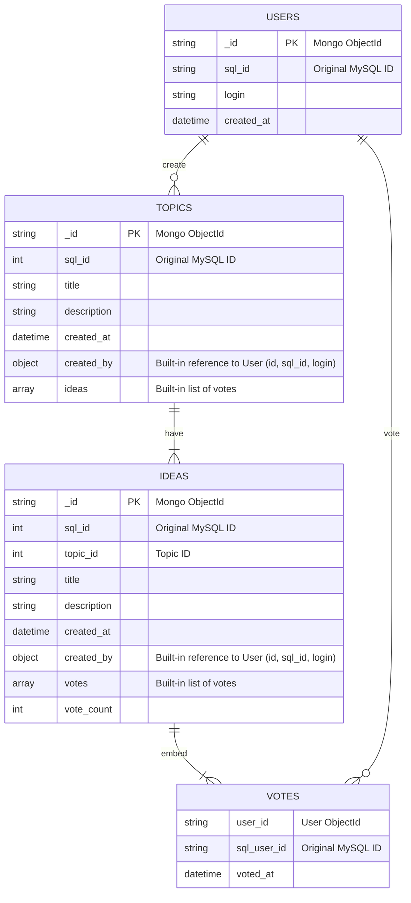

# MongoDB Data Model

This document describes the proposed MongoDB data model for the application, designed to efficiently store and retrieve information related to users, topics, ideas, and votes. The model leverages MongoDB's document-oriented nature by embedding related data where appropriate, while also maintaining references to the original MySQL IDs for migration and traceability.

## Schema Diagram



## Model Description

*   **USERS:** An independent collection storing user information. Each user document has a unique `_id` (MongoDB's ObjectId), a `sql_id` to link back to the original MySQL user, their `login`, and `created_at` timestamp.
*   **TOPICS:** An independent collection for topics. Each topic document includes its `_id`, `sql_id`, `title`, `description`, `created_at` timestamp, and an embedded `created_by` object (containing `id`, `sql_id`, and `login` of the user who created it). It also contains an embedded array of `ideas`.
*   **IDEAS:** Embedded within `TOPICS` documents. Each idea document has its `_id`, `sql_id`, `topic_id` (redundant but useful for quick lookups if ideas were ever queried independently), `title`, `description`, `created_at` timestamp, an embedded `created_by` object, an embedded `votes` array, and a `vote_count`.
*   **VOTES:** Embedded within `IDEAS` documents. Each vote document records the `user_id` (MongoDB ObjectId of the voter), `sql_user_id` (original MySQL ID of the voter), and the `voted_at` timestamp.

## Example Documents

### USERS Collection

```json
{
  "_id": ObjectId("654c2a1a0123456789abcdef"),
  "sql_id": "1",
  "login": "john.doe",
  "created_at": ISODate("2023-10-26T10:00:00Z")
}
```

### TOPICS Collection

```json
{
  "_id": ObjectId("654c2a1a0123456789abcdef"),
  "sql_id": 101,
  "title": "Discussing New Features",
  "description": "A topic to gather ideas for upcoming features.",
  "created_at": ISODate("2023-10-26T10:05:00Z"),
  "created_by": {
    "id": "654c2a1a0123456789abcdef",
    "sql_id": "1",
    "login": "john.doe"
  },
  "ideas": [
    {
      "_id": ObjectId("654c2a1a0123456789abcde1"),
      "sql_id": 201,
      "topic_id": 101,
      "title": "Implement Dark Mode",
      "description": "Users often request a dark mode for better readability.",
      "created_at": ISODate("2023-10-26T10:10:00Z"),
      "created_by": {
        "id": "654c2a1a0123456789abcdef",
        "sql_id": "1",
        "login": "john.doe"
      },
      "votes": [
        {
          "user_id": "654c2a1a0123456789abcdef",
          "sql_user_id": "1",
          "voted_at": ISODate("2023-10-26T10:15:00Z")
        },
        {
          "user_id": "654c2a1a0123456789abcde2",
          "sql_user_id": "2",
          "voted_at": ISODate("2023-10-26T10:16:00Z")
        }
      ],
      "vote_count": 2
    },
    {
      "_id": ObjectId("654c2a1a0123456789abcde3"),
      "sql_id": 202,
      "topic_id": 101,
      "title": "Add Real-time Notifications",
      "description": "Notify users instantly about new activities.",
      "created_at": ISODate("2023-10-26T10:20:00Z"),
      "created_by": {
        "id": "654c2a1a0123456789abcdef",
        "sql_id": "1",
        "login": "john.doe"
      },
      "votes": [],
      "vote_count": 0
    }
  ]
}
```